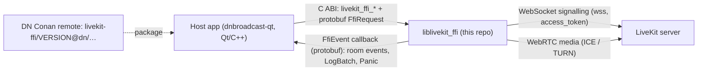
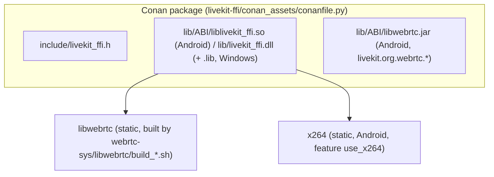
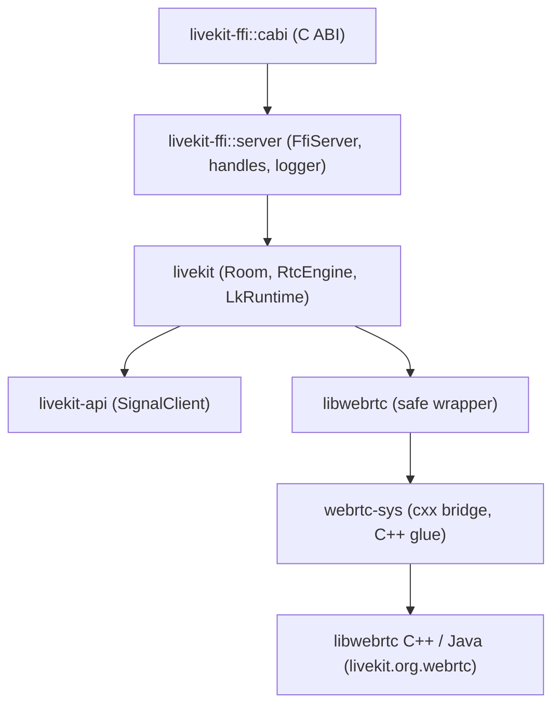

# Architecture — dn_livekit_ffi

Scope: the parts DisplayNote builds and ships. The upstream SDK internals
(`livekit/`, `livekit-api/`, `livekit-protocol/`) are documented upstream at
<https://github.com/livekit/rust-sdks>.

## Context

## Containers (what ends up in the Conan package)

Android ABIs: `arm64-v8a`, `armeabi-v7a`, `x86_64` (recipe + `generate_conan_build.sh`);
the Azure pipeline builds `arm64-v8a`, `armeabi-v7a` and Windows `x86_64`.

## Components (Rust crates in the shipped library)

## Main data flows

1. **Initialisation** — host calls `livekit_ffi_initialize(cb, capture_logs, sdk, sdk_version)`
   (`livekit-ffi/src/cabi.rs`). `FfiServer::setup` stores the callback and sets
   `FfiLogger::capture_logs` (`livekit-ffi/src/server/mod.rs`).
2. **Requests** — host sends protobuf `FfiRequest` through `livekit_ffi_request`;
   `server::requests::handle_request` dispatches; async work replies later through the
   callback as `FfiEvent`.
3. **Connect** — `ConnectRequest { url, token, options }` → `FfiRoom::connect`
   (`livekit-ffi/src/server/room.rs`) → `Room::connect` → `SignalClient::connect`
   (WebSocket with `access_token` query) → `JoinResponse` (room, participants, ICE/TURN
   servers) → peer connections.
4. **SW H264 policy (DN)** — host calls `livekit_ffi_set_force_sw_h264(bool)` before the
   first connect; `LkRuntime::instance()` reads the flag once and passes it to
   `PeerConnectionFactory::new`, which on Android selects the SW MediaCodec H264
   factory in `AndroidVideoEncoderFactory`.
5. **Logging** — see [runbooks/debugging-with-ai.md](runbooks/debugging-with-ai.md):
   Rust `log` records (plus libwebrtc `RTC_LOG` via a native log sink) go either to
   `env_logger` (stderr) or, with `capture_logs`, to the host as `LogBatch` events.

## Active architectural decisions

- Rename Android WebRTC packages to `livekit.org.webrtc` instead of sharing the host's
  `org.webrtc` (allows two WebRTC versions in one APK) — `FORK_DOCUMENTATION.md`.
- Ship the C++ runtime as `c++_shared` on Android (`webrtc-sys/build.rs`).
- Keep the SW-H264 decision in the host app: the library exposes a setter and never
  probes devices itself (commit `be350292` removed the auto-probe).
